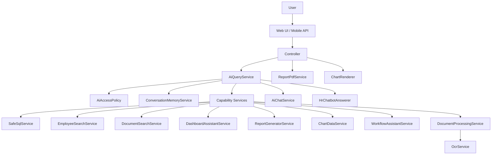

# AI Chatbot Architecture

This document describes the architecture of the AI Assistant feature in PRIME HRIS Pagsanjan. The implementation is a Laravel-based, permission-aware assistant that can answer HR questions, search employee records, find uploaded files, generate reports, create charts, draft workflow documents, and export results as PDF.

---

## 1. Purpose and scope

The assistant is designed to provide a single natural-language interface over HR data without exposing that data broadly.

It supports:

- employee and personnel lookups
- document and file retrieval
- dashboard-style metrics and summaries
- generated reports with table output
- charts and visual summaries
- workflow drafting such as leave summaries, payroll previews, onboarding checklists, and HR letters
- PDF export for generated outputs

The system is intentionally split into a thin controller layer and a rich service layer so business logic, permissions, and AI integration remain testable and reusable.

---

## 2. High-level architecture

The assistant is composed of four layers:

1. Entry points
   - web UI routes for admin, employee, and mayor areas
   - mobile / API routes for the mobile client

2. Controller layer
   - receives the message, persists conversation context, and packages the response for UI/API consumption

3. Service layer
   - classifies intent
   - enforces permissions
   - routes the request to the correct capability service
   - executes database-backed or LLM-backed logic

4. Data layer
   - HR tables such as employees, attendance, leave applications, documents, salary computations, and trainings
   - conversation storage for multi-turn assistant history

---

## 3. Request lifecycle

A request moves through the system in a consistent order.

### 3.1 Entry point

The assistant is available through:

- web routes under [primeHrMagdalenaLaravel/routes/web.php](../routes/web.php)
- API routes under [primeHrMagdalenaLaravel/routes/api.php](../routes/api.php)

The web routes expose the assistant in the admin, employee, and mayor areas:

- /admin/ai-assistant/message
- /employee/ai-assistant/message
- /mayor/ai-assistant/message

The API exposes mobile-friendly endpoints such as:

- POST /api/ai/query
- GET /api/ai/export/{token}

### 3.2 Controller handling

The main web controller is [primeHrMagdalenaLaravel/app/Http/Controllers/AiAssistantController.php](../app/Http/Controllers/AiAssistantController.php), while the API controller is [primeHrMagdalenaLaravel/app/Http/Controllers/Api/AiAssistantController.php](../app/Http/Controllers/Api/AiAssistantController.php).

These controllers are intentionally thin:

- validate the request
- load or create a conversation
- retrieve recent message history
- call the orchestration service
- persist the assistant reply
- attach structured data, charts, and export tokens for the UI

### 3.3 Orchestration and intent routing

The orchestration happens in [primeHrMagdalenaLaravel/app/Services/AiQueryService.php](../app/Services/AiQueryService.php).

The flow is:

1. validate that the user can use the assistant
2. resolve follow-up questions with conversation memory
3. classify the intent
4. dispatch to the correct capability service
5. attach a table specification when the answer includes rows
6. log the interaction for audit purposes

### 3.4 Capability execution

Depending on the detected intent, the service dispatches to one of the specialized services:

- employee search
- document search
- dashboard metrics
- report generation
- chart generation
- workflow drafting
- ad-hoc SQL-based data querying

---

## 4. Core components

### 4.1 AiQueryService

File: [primeHrMagdalenaLaravel/app/Services/AiQueryService.php](../app/Services/AiQueryService.php)

This is the central orchestrator.

Responsibilities:

- decide whether the user is allowed to use the assistant
- resolve conversational follow-ups
- detect the intent of the message
- route to the right service
- attach result tables and metadata
- write audit records

Intent routing is rule-based first, with a model-based fallback when the pattern match is insufficient.

### 4.2 AiAccessPolicy

File: [primeHrMagdalenaLaravel/app/Services/AiAccessPolicy.php](../app/Services/AiAccessPolicy.php)

This is the single source of truth for permissions.

Key behaviors:

- active users with roles can use the assistant
- org-wide roles include admin, hr, and mayor
- employee-level users are scoped to their own employee record
- generated SQL is restricted to org-wide roles
- every service should use this policy rather than embedding permission logic inline

### 4.3 AiChatService

File: [primeHrMagdalenaLaravel/app/Services/AiChatService.php](../app/Services/AiChatService.php)

This is the provider abstraction for LLM calls.

It supports multiple providers:

- OpenAI-compatible endpoints
- Anthropic
- Groq (default fallback)

Configuration order:

1. the caller’s personal AI setting
2. the system-wide AI setting
3. the environment-level GROQ API key

This ensures the assistant can work with a provider configured per user, per organization, or globally.

### 4.4 ConversationMemoryService

File: [primeHrMagdalenaLaravel/app/Services/ConversationMemoryService.php](../app/Services/ConversationMemoryService.php)

This service rewrites short follow-up messages such as “now generate a report” into a fuller, self-contained question based on recent conversation context.

Example:

- user: “Show John’s leave records”
- user: “Now generate a report”
- resolved: “Generate a report of John’s leave records”

### 4.5 HrChatbotAnswerer

File: [primeHrMagdalenaLaravel/app/Services/HrChatbotAnswerer.php](../app/Services/HrChatbotAnswerer.php)

This is the fallback reasoning layer for policy and conversational HR questions that do not require database access.

It is deliberately DB-free and focused on general HR guidance, system rules, and policy-style questions.

---

## 5. Capability services

### 5.1 EmployeeSearchService

File: [primeHrMagdalenaLaravel/app/Services/EmployeeSearchService.php](../app/Services/EmployeeSearchService.php)

Handles queries about people, departments, employment status, hire dates, and employee records.

Capabilities:

- parse natural-language queries into structured filters
- search employees by name, employee number, department, appointment year, and status
- apply access scoping through AiAccessPolicy
- return rows suitable for table rendering and narration

### 5.2 DocumentSearchService

File: [primeHrMagdalenaLaravel/app/Services/DocumentSearchService.php](../app/Services/DocumentSearchService.php)

Searches uploaded files and related artifacts across multiple sources:

- documents
- training certificates
- employee photos

It also uses semantic expansion so queries like “medical certificate” can match related terms.

### 5.3 DashboardAssistantService

File: [primeHrMagdalenaLaravel/app/Services/DashboardAssistantService.php](../app/Services/DashboardAssistantService.php)

Answers dashboard-style questions such as:

- how many employees are on record
- who is on leave today
- absenteeism by department
- pending approvals
- headcount by department
- missing requirements
- new hires

This service is restricted to org-wide roles because several metrics span the organization.

### 5.4 ReportGeneratorService

File: [primeHrMagdalenaLaravel/app/Services/ReportGeneratorService.php](../app/Services/ReportGeneratorService.php)

Generates structured reports for common HR topics:

- attendance
- leave
- payroll
- department
- hiring
- training
- employee summary

Each report returns:

- prose answer
- row data
- column definitions
- totals
- a report definition suitable for PDF export

### 5.5 ChartDataService

File: [primeHrMagdalenaLaravel/app/Services/ChartDataService.php](../app/Services/ChartDataService.php)

Generates chart specifications rather than drawing the chart directly.

It chooses chart form based on the data’s purpose:

- bar charts for magnitudes
- line charts for trends
- stacked bars for part-to-whole relationships
- grouped bars for comparisons

The service also folds too many categories into an “Other” bucket and uses a fixed palette to preserve readability and accessibility.

### 5.6 WorkflowAssistantService

File: [primeHrMagdalenaLaravel/app/Services/WorkflowAssistantService.php](../app/Services/WorkflowAssistantService.php)

Drafts workflow-oriented outputs such as:

- leave approval summaries
- payroll previews
- employee summaries
- onboarding checklists
- HR letters

The service first gathers real data from the database and then asks the LLM to write the prose around those facts.

### 5.7 SafeSqlService

File: [primeHrMagdalenaLaravel/app/Services/SafeSqlService.php](../app/Services/SafeSqlService.php)

This is the read-only SQL engine for ad-hoc, natural-language data questions.

It is the most security-sensitive part of the system.

Responsibilities:

- transform a natural-language question into a SQL SELECT statement
- validate that the statement is safe
- reject dangerous statements and forbidden keywords
- enforce a table allow-list
- enforce a row cap of 200 rows
- run the query and narrate the result

This service is only available to org-wide roles because unconstrained SQL is not safe for self-scoped users.

### 5.8 DocumentProcessingService and OcrService

Files:

- [primeHrMagdalenaLaravel/app/Services/DocumentProcessingService.php](../app/Services/DocumentProcessingService.php)
- [primeHrMagdalenaLaravel/app/Services/OcrService.php](../app/Services/OcrService.php)

These services make uploaded files searchable by content rather than only by filename.

The processing flow is:

- inspect stored documents and training certificates
- extract text from PDF, DOCX, and image files
- store the result in document extraction records
- fall back to OCR when the file is a scan or image and OCR is available
- mark the document as requiring OCR when the toolchain is missing

This powers the “find the file that mentions X” behavior in the assistant.

---

## 6. Conversation and persistence model

The assistant stores conversation history so follow-up questions remain contextual.

Conversation persistence is handled through the model [primeHrMagdalenaLaravel/app/Models/AiConversation.php](../app/Models/AiConversation.php).

Each conversation contains:

- a user id
- a title
- a collection of messages

The controller loads recent messages from the conversation and passes them into the orchestration service as history.

This allows multi-turn interactions such as:

- “show me the attendance report for June”
- “now make it a chart”
- “export it”

---

## 7. Security model

Security is one of the most important architectural decisions in this implementation.

### 7.1 Permission scoping

The assistant never trusts the UI to decide what a user can see.

Permissions are enforced centrally through [primeHrMagdalenaLaravel/app/Services/AiAccessPolicy.php](../app/Services/AiAccessPolicy.php).

The policy:

- scopes employee queries to the current employee for self-scoped users
- allows org-wide roles to see broader data
- prevents unrestricted SQL for non-org-wide roles

### 7.2 Read-only SQL guardrails

The SQL path uses [primeHrMagdalenaLaravel/app/Services/SafeSqlService.php](../app/Services/SafeSqlService.php) to enforce a strict allow-list and block dangerous operations.

It rejects statements that:

- contain more than one statement
- are not SELECT or WITH SELECT
- use forbidden SQL keywords
- reference restricted schemas
- touch disallowed tables
- exceed the row cap

This makes natural-language data access safe by construction.

### 7.3 Audit logging

The assistant writes audit events for each interaction so HR administrators can see who asked what and how the assistant responded.

The logging is designed to count results and record metadata rather than storing sensitive HR rows in the log.

### 7.4 Export security

Report export uses a short-lived token generated by [primeHrMagdalenaLaravel/app/Services/ReportPdfService.php](../app/Services/ReportPdfService.php).

The token:

- is bound to the generating user
- expires after one hour
- is exchanged for a PDF on download

This prevents the export URL from being reusable by another user without the session context.

---

## 8. Output rendering

The assistant returns structured output to the UI.

### 8.1 Tables

When a response contains rows, AiQueryService attaches a table specification so the UI can render a table underneath the answer.

### 8.2 Charts

Charts are produced as render-agnostic specs by [primeHrMagdalenaLaravel/app/Services/ChartDataService.php](../app/Services/ChartDataService.php) and rendered to inline SVG by [primeHrMagdalenaLaravel/app/Services/ChartRenderer.php](../app/Services/ChartRenderer.php).

This is deliberate because the same chart markup needs to work in:

- the browser UI
- printed documents
- PDF export

### 8.3 PDF export

The PDF export path is handled by [primeHrMagdalenaLaravel/app/Services/ReportPdfService.php](../app/Services/ReportPdfService.php), which packages a report, rows, and chart SVG into a downloadable PDF.

---

## 9. Architectural strengths

This design has several advantages:

- clear separation of concerns between controllers, orchestration, and domain logic
- centralized permission handling
- read-only SQL execution with strong guardrails
- provider-agnostic LLM access
- support for both web and mobile clients through the same backend logic
- chart and PDF export support without needing a front-end charting library

---

## 10. Architectural trade-offs and important notes

A few implementation choices matter for maintainability:

- the assistant is intentionally conservative with SQL; it favors safe, validated behavior over broad flexibility
- the fallback LLM path is used for prose and summarization, not as a substitute for access control
- document content search depends on the indexing pipeline being run and OCR being available when needed
- some UI behaviors such as charts and exported tables are driven by structured return payloads rather than by the raw text answer alone

---

## 11. Suggested extension points

If you want to extend the feature further, the best insertion points are:

- add a new capability service and register it in [primeHrMagdalenaLaravel/app/Services/AiQueryService.php](../app/Services/AiQueryService.php)
- add permission rules in [primeHrMagdalenaLaravel/app/Services/AiAccessPolicy.php](../app/Services/AiAccessPolicy.php)
- add provider behavior in [primeHrMagdalenaLaravel/app/Services/AiChatService.php](../app/Services/AiChatService.php)
- add document indexing coverage in [primeHrMagdalenaLaravel/app/Services/DocumentProcessingService.php](../app/Services/DocumentProcessingService.php)
- add chart types in [primeHrMagdalenaLaravel/app/Services/ChartDataService.php](../app/Services/ChartDataService.php)

---

## 12. Summary

The AI chatbot architecture in this app is a layered Laravel implementation that combines:

- a thin request/response controller layer
- a central orchestration service
- permission-aware capability services
- a validated SQL path for data questions
- LLM-backed narration and drafting
- structured chart and PDF export output

This makes it both practical for HR operations and safe enough for sensitive employee data.
